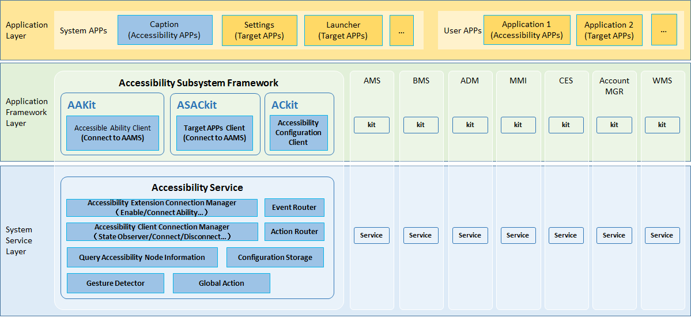

# 无障碍软件服务子系统
# 简介<a name="intro"></a>

**无障碍框架**提供在应用程序和辅助应用之间交换信息的标准机制，支持开发辅助应用增强无障碍功能体验。



# 目录<a name="files"></a>

```
├── frameworks
│   ├── aafwk               # AccessibleAbility Kit实现代码
│   └── asacfwk             # AccessibleAbilityClient Kit实现代码
├── interfaces
│   ├── innerkits           # AccessibleAbility 和 AccessibleAbilityClient 的子系统接口
│   └── kits                # AccessibleAbility 和 AccessibleAbilityClient 的开发者接口
├── services
│   └── aams                # AccessibleAbility 管理服务框架代码
├── test                    # 测试目录
└── util                    # 工具类目录
```

# 使用说明<a name="usage"></a>

### isOpenAccessibility(): Promise\<boolean>

检查是否启用了辅助功能。

- 参数：

  无

- 返回值：

  | 类型  | 说明  |
  | --- | --- |
  | Promise\<boolean> | 以Promise形式返回结果，如果辅助功能已启用，则返回true；如果辅助功能未启用，则返回false。 |

- 示例

  ```js
  accessibility.isOpenAccessibility()
      .then((data) => {
      console.info('success data:isOpenAccessibility : ' + JSON.stringify(data))
  }).catch((error) => {
      console.error('failed to  isOpenAccessibility because ' + JSON.stringify(error));
  })
  ```

### sendEvent(event: EventInfo): Promise\<void>

发送无障碍事件。

- 参数：

  | 参数名 | 参数类型 | 必填  | 说明  |
  | --- | --- | --- | --- |
  | event | EventInfo | 是   | 辅助事件对象。 |

- 返回值：

  | 类型  | 说明  |
  | --- | --- |
  | Promise<void> | 以Promise形式返回结果，如果发送无障碍事件成功，则data有数据返回；如果发送无障碍事件失败，则err有数据返回。 |

- 示例

  ```js
  accessibility.sendEvent(this.eventInfo)
      .then((data) => {
      console.info('success data:sendEvent : ' + JSON.stringify(data))
  }).catch((error) => {
      console.error('failed to  sendEvent because ' + JSON.stringify(error));
  })
  ```
